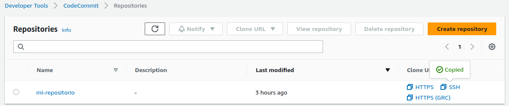

# Prácticas Devops en Amazon Web Services (AWS)
# Aplicación contenerizada con despliegue manual

Ahora que hemos configurado nuestra infraestructura, es el momento de llevar a cabo un despliegue de aplicaciones sobre Kubernetes utilizando un enfoque moderno y contenerizado.

En este enfoque, en lugar de utilizar el tradicional despliegue en servidores físicos o máquinas virtuales, aprovecharemos la potencia de Kubernetes para crear un entorno altamente escalable y basado en contenedores. Kubernetes nos proporciona características avanzadas de orquestación y administración de contenedores, facilitando el despliegue y el mantenimiento de nuestra aplicación en diferentes entornos.

Si bien esta existen más objetos que nos brindan posibilidades muy ricas, con estos primeros pasos ya obtendremos beneficios como la portabilidad, la automatización y la capacidad de escalar rápidamente nuestra aplicación. 


## ¿Qué necesitamos?

Antes de comenzar, es importante tener en cuenta que en Kubernetes se siguen prácticas basadas en microservicios, en las que múltiples componentes con responsabilidades específicas trabajan de forma desacoplada. Esto nos brinda flexibilidad, escalabilidad y otros beneficios.

Por el momento, nos centraremos en los objetos y despliegues necesarios para alojar nuestra aplicación estática y servir su contenido a través de Internet.

### Define variables

Para comenzar muévete al directorio $HOME e ingresa al directorio mi-repositorio

```shell
cd $HOME/mi-repositorio && mkdir codigo && cd codigo
```
Importante: Si no lo encuentras puedes volver a clonarlo copiando el enlace de SSH provisto por Code Commit.

<div align="center">
  
</div>


Luego define variables para reutilizarlas

```shell
export ESPACIO_NOMBRES_APLICACION_MANUAL="despliegue-manual"
export SERVICIO_APLICACION_MANUAL="servicio-aplicacion-estatica"
export NOMBRE_APLICACION_MANUAL="aplicacion-estatica"
export NOMBRE_DESPLIEGUE="aplicacion-estatica"
export CONFIGMAP_APLICACION_MANUAL="aplicacion-estatica"
export NOMBRE_INGRESO="ingreso-aplicacion-estatica"
export DOMINIO=$(aws route53 list-hosted-zones --query 'HostedZones[0]'.Name | cut -d'"' -f2 | sed 's/\.$//')
export HOSTNAME_APLICACION="$NOMBRE_APLICACION_MANUAL.$DOMINIO"
```

### Crea un Namespace

Un espacio de nombres (Namespace) en Kubernetes es un mecanismo utilizado para organizar y separar los recursos en un clúster. Puedes pensar en un namespace como un contenedor virtual que ayuda a mantener los recursos de Kubernetes aislados y separados unos de otros.

Cada clúster de Kubernetes tiene un conjunto predeterminado de namespaces, como "default", "kube-system" y "kube-public". Sin embargo, también puedes crear tus propios namespaces para organizar tus aplicaciones y recursos de acuerdo con tus necesidades.

La creación de namespaces te permite tener múltiples entornos (por ejemplo, desarrollo, prueba, producción) en el mismo clúster sin que se produzcan conflictos entre los recursos. Cada namespace tiene su propio conjunto de recursos, incluidos pods, servicios, volúmenes persistentes, secretos y configuraciones.

Además de proporcionar aislamiento, los namespaces también ayudan a mejorar la legibilidad y la gestión de los recursos en un clúster. Puedes definir políticas de acceso y control de recursos a nivel de namespace, lo que facilita la administración de permisos y la aplicación de políticas de seguridad.

Prepara la descripción de un espacio de nombres dedicado para nuestra aplicación estática.

```shell
cat << EOF > namespace-aplicacion-estatica.yaml
apiVersion: v1
kind: Namespace
metadata:
  name: $ESPACIO_NOMBRES_APLICACION_MANUAL
EOF
```

Despliega el espacio de nombres con el siguiente comando. 

```shell
kubectl apply -f namespace-aplicacion-estatica.yaml
```

Dado que estamos describiendo el estado deseado si vuelves a ejecutar el mismo comando no dará error ni duplicará el espacio de nombres dado que Kubernetes entiende que el estado deseado ya es el estado actual. Verifícalo repitiendo el comando anterior.

```shell
kubectl apply -f namespace-aplicacion-estatica.yaml
```

Deberías recibir un mensaje indicando que no hubo cambios.

### Crea un Service

Un servicio (Service) en Kubernetes es un objeto que se utiliza para exponer una aplicación o conjunto de pods dentro del clúster. Proporciona una forma de acceder a los pods de manera transparente y estable, independientemente de su ubicación o cambios en su ciclo de vida.

El servicio se asocia a uno o varios pods a través de selectores de etiquetas (labels). Los pods seleccionados se agrupan lógicamente y el servicio les asigna una dirección IP y un nombre DNS único dentro del clúster. Esto permite que otros componentes del clúster se comuniquen con los pods utilizando el nombre del servicio.

Los servicios en Kubernetes tienen ciclos de vida independientes de los pods. Incluso si los pods se escalan a cero o se recrean, el servicio sigue existiendo, lo que brinda una capa de abstracción y estabilidad en el acceso a la aplicación.

En nuestro caso, utilizaremos el tipo de servicio NodePort en combinación con un balanceador de carga externo (ALB) para exponer nuestra aplicación estática al tráfico externo. Esto nos permite enrutar las solicitudes hacia los nodos del clúster y distribuir la carga de manera eficiente.

Crea un nuevo fichero para describir el servicio asociado a la aplicación estática.

```shell
cat << EOF > servicio-aplicacion-estatica.yaml
apiVersion: v1
kind: Service
metadata:
  name: $SERVICIO_APLICACION_MANUAL
  namespace: $ESPACIO_NOMBRES_APLICACION_MANUAL
spec:
  type: NodePort
  selector:
    app: nodejs
  ports:
    - name: http
      port: 3000
      targetPort: 3000
      nodePort: 30053
EOF
```

Aplica la configuración ejecutando el siguiente comando:

```shell
kubectl apply -f servicio-aplicacion-estatica.yaml
```
### Crea un ConfigMap

Un ConfigMap en Kubernetes es un objeto que se utiliza para almacenar y gestionar la configuración de la aplicación. Permite separar la configuración de la aplicación del código fuente, lo que facilita la administración y la personalización de la configuración sin necesidad de volver a generar ni reconstruir la imagen del contenedor.

El ConfigMap almacena datos clave-valor y se puede utilizar para configurar variables de entorno, argumentos de línea de comandos o archivos de configuración dentro de los pods de la aplicación.

Tener desacoplada la configuración permite mayor reutilización, por ejemplo, cuando se usa la misma imagen para distintos ambientes que por lo general requieren distintas configuraciones.

En nuestro caso utilizaremos el ConfigMap para montar un volumen en el contenedor y allí dejaremos el código de nuestra aplicación estática, dado que es un nodejs, el ficher que montaremos será el index.js.

Comienza con un fichero que no tenga demasiada complejidad y luego si lo deseas puedes ir modificándolo.

```shell
cat << EOF > configmap-aplicacion-estatica.yaml
apiVersion: v1
kind: ConfigMap
metadata:
  name: $CONFIGMAP_APLICACION_MANUAL
  namespace: $ESPACIO_NOMBRES_APLICACION_MANUAL
data:
  index.js: |-
    const http = require('http');
    const os = require('os');
    const hostname = os.hostname();
    let intervalId;
    const server = http.createServer((req, res) => {
      res.writeHead(200, { 'Content-Type': 'text/html' });
      res.write(\`
        <html>
          <head>
            <title>Despliegue manual</title>            
          </head>
          <body>
            <h1>Mi primera aplicación estática en Kubernetes!</h1>
            <p>Estoy corriendo sobre el POD: \${hostname}</p>
          </body>
        </html>
      \`);    
      res.end();
    });

    server.listen(3000, () => {
      console.log('Server running at http://localhost:3000/');
    });
EOF
```

Aplica la configuración en Kubernetes del ConfigMap descripto en el fichero:

```shell
kubectl apply -f configmap-aplicacion-estatica.yaml
```

### Crea un Deployment

Un despliegue (Deployment) en Kubernetes es un objeto que define cómo se ejecutan y se administran los pods en el clúster. Proporciona una forma declarativa de gestionar la creación, actualización y escalado de los pods que forman parte de una aplicación.

El despliegue se encarga de mantener un conjunto deseado de réplicas de los pods definidos. Si algún pod falla o se elimina, el despliegue automáticamente creará nuevos pods para reemplazarlos, asegurando que el número de réplicas especificado siempre esté disponible.

Además, el despliegue permite realizar actualizaciones controladas de la aplicación sin tiempo de inactividad. Puedes aplicar cambios en la configuración o la imagen del contenedor, y el despliegue se encargará de crear nuevos pods con la nueva versión y eliminar gradualmente los pods antiguos.

```shell
cat << EOF > despliegue-aplicacion-estatica.yaml
apiVersion: apps/v1
kind: Deployment
metadata:
  name: $NOMBRE_DESPLIEGUE
  namespace: $ESPACIO_NOMBRES_APLICACION_MANUAL
spec:
  replicas: 1
  selector:
    matchLabels:
      app: nodejs
  template:
    metadata:
      labels:
        app: nodejs
    spec:
      containers:
        - name: nodejs
          image: node:14-alpine
          command: ["node"]
          args: ["/app/index.js"]
          ports:
            - containerPort: 3000
          volumeMounts:
            - name: app
              mountPath: /app
          env:
            - name: RANDOM_INTERVAL
              value: "200"
          resources:
            requests:
              cpu: 100m
              memory: 128Mi
            limits:
              cpu: 250m
              memory: 256Mi
      volumes:
        - name: app
          configMap:
            name: $CONFIGMAP_APLICACION_MANUAL
            items:
              - key: index.js
                path: index.js
EOF

```

Como siempre, ahora ejecuta el comando para aplicar los cambios.

```shell
kubectl apply -f despliegue-aplicacion-estatica.yaml
```

### Crea un Ingress

En Kubernetes, un ingreso (Ingress) es un objeto que actúa como un controlador de tráfico para enrutar las solicitudes de entrada a los servicios adecuados dentro del clúster. Proporciona una capa de entrada para el tráfico externo y permite configurar reglas de enrutamiento basadas en la URL, los encabezados u otros criterios.

El Ingress actúa como un punto de entrada único para varias aplicaciones y servicios dentro del clúster. Permite exponer servicios internos al mundo exterior y controlar el acceso a través de reglas de enrutamiento flexibles.

```shell
cat << EOF > ingreso-aplicacion-estatica.yaml
apiVersion: networking.k8s.io/v1
kind: Ingress
metadata:
  name: $NOMBRE_INGRESO
  namespace: $ESPACIO_NOMBRES_APLICACION_MANUAL
  annotations:  
    provider: alb
    kubernetes.io/ingress.class: alb   
    alb.ingress.kubernetes.io/scheme: internet-facing
    alb.ingress.kubernetes.io/group.name: ingress-demo
    alb.ingress.kubernetes.io/target-type: instance    
    alb.ingress.kubernetes.io/healthcheck-protocol: HTTP
    alb.ingress.kubernetes.io/healthcheck-port: traffic-port
    alb.ingress.kubernetes.io/healthcheck-interval-seconds: '15'
    alb.ingress.kubernetes.io/healthcheck-timeout-seconds: '5'
    alb.ingress.kubernetes.io/success-codes: '200'
    alb.ingress.kubernetes.io/healthy-threshold-count: '2'
    alb.ingress.kubernetes.io/unhealthy-threshold-count: '2'    
    external-dns.alpha.kubernetes.io/hostname: $HOSTNAME_APLICACION
spec:
  rules:
    - host: $HOSTNAME_APLICACION
      http:
        paths:
          - path: /
            pathType: Prefix
            backend:
              service:
                name: $SERVICIO_APLICACION_MANUAL
                port:
                  number: 3000
EOF
```

Ahora crea el ingreso utilizando nuevamente kubectl.

```shell
kubectl apply -f ingreso-aplicacion-estatica.yaml
```

Continua con [AWS CodeBuild](codebuild.md). También puedes revisar nuevamente el paso anterior [Amazon Route 53](route53.md) o volver al [Indice](indice.md)