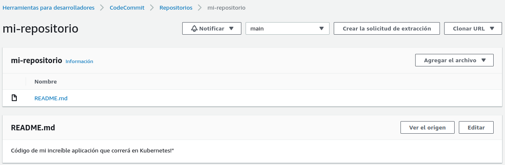

# Prácticas Devops en Amazon Web Services (AWS)
## AWS Code Commit

Exploraremos AWS Code Commit, un servicio de alojamiento de repositorios de control de versiones completamente administrado por AWS. Con Code Commit, podrás almacenar de forma segura y gestionar el código fuente de tus aplicaciones, facilitando la colaboración entre equipos de desarrollo.

Commit te permite mantener un historial completo de cambios en el código, realizar seguimiento de versiones, implementar flujos de trabajo de revisión de código y más. Además, aprovecharemos las integraciones nativas con otros servicios de AWS para simplificar tus procesos de desarrollo y despliegue.

### Prepara el sistema operativo

Si estás utilizando la AWS CloudShell, ya cuentas con un entorno de línea de comandos preconfigurado y listo para usar. Para comenzar a trabajar con AWS Code Commit desde línea de comandos, es recomendable contar con una clave SSH. Utilizaremos esta clave SSH para autenticar tus conexiones a los repositorios sin necesidad de ingresar usuario y contraseña.

#### Crea una nueva clave dejando los valores por defecto

La clave SSH generada será única y específica para tu cuenta de AWS. Te recomendamos mantenerla segura y no compartirla con otras personas.

```shell
ssh-keygen -t rsa -b 4096 -f ~/.ssh/codecommit_rsa
```

Con esta clave SSH, podrás realizar operaciones seguras en Code Commit, como clonar repositorios, hacer commits y push de cambios, y realizar otras operaciones relacionadas con el control de versiones de tu código fuente.

#### Sube la clave a AWS IAM teniendo en cuenta el usuario con el que ingresas a AWS, para este ejemplo, cloud_user

Para asociar tu clave SSH con tu usuario de AWS y poder autenticar tus conexiones a los repositorios de Code Commit, ejecuta el siguiente comando en tu AWS CloudShel:

```shell
aws iam upload-ssh-public-key --user-name cloud_user --ssh-public-key-body file://~/.ssh/codecommit_rsa.pub
```

Si deseas verificar el resultado en la AWS Management Console dirígete a IAM > Usuarios > cloud_user > Credenciales de seguridad > Claves públicas SSH para AWS CodeCommit 

<div align="center">
  
</div>

#### Exporta el ID de la clave pública de SSH

Una vez que hayas subido la clave pública SSH a AWS IAM, necesitarás exportar el ID de la clave pública para completar la configuración de acceso. Puedes hacerlo ejecutando el siguiente comando en tu AWS CloudShell:

```shell
export SSHKEYID=$(aws iam list-ssh-public-keys --user-name cloud_user | grep -oP '(?<="SSHPublicKeyId": ")[^"]+' | awk 'NR==1')
echo $SSHKEYID
```

Este comando te proporcionará el ID de la clave pública SSH asociada con el usuario "cloud_user" y exportará el ID, ya que lo necesitarás en pasos posteriores para finalizar la configuración de acceso a los repositorios de Code Commit.

#### Configuración adicional de SSH

Para finalizar la configuración de acceso a los repositorios de Code Commit, necesitarás agregar algunas líneas al archivo de configuración de SSH. Este archivo, por defecto, se encuentra en la ruta ~/.ssh/config.


```shell
cat << EOF >> ~/.ssh/config
Host git-codecommit.*.amazonaws.com
User $SSHKEYID
IdentityFile ~/.ssh/codecommit_rsa
EOF
```

Estas líneas le indican a SSH cómo autenticar las conexiones a los repositorios de Code Commit utilizando tu clave SSH recién generada.

Con estas configuraciones adicionales, estarás listo para acceder y trabajar con los repositorios de Code Commit de forma segura y sin problemas de autenticación.

#### Limita los permisos sobre el archivo

Para garantizar la seguridad de tu archivo de configuración de SSH, es recomendable limitar los permisos de acceso. Puedes hacerlo utilizando el siguiente comando en tu terminal:

```shell
chmod 600 ~/.ssh/config
```

Esto establecerá los permisos adecuados para que solo el propietario del archivo pueda leer y modificar su contenido. Al restringir los permisos, se reduce el riesgo de accesos no autorizados a tus configuraciones de SSH.

## Crea tu primer repositorio

Para crear tu primer repositorio en AWS Code Commit, puedes utilizar el siguiente script en la AWS CloudShell:

```shell
cat << EOF > crear_repo.sh
#!/bin/bash

NOMBRE_REPO="mi-repositorio"
aws codecommit create-repository --repository-name $NOMBRE_REPO
EOF
```

Este script crea un nuevo repositorio con el nombre especificado en la variable NOMBRE_REPO. Puedes personalizar el nombre del repositorio según tus necesidades. Al ejecutar el script, se creará el repositorio en Code Commit y estará listo para su uso.

### Modifica los permisos y ejecuta el script

Este comando otorgará permisos de ejecución al script, lo cual te permitirá ejecutarlo sin problemas.

```shell
chmod +x crear_repo.sh && ./crear_repo.sh
```

Al ejecutar el script, se creará un nuevo repositorio en AWS Code Commit con el nombre especificado en el script. Asegúrate de ajustar el valor de la variable NOMBRE_REPO en el script según el nombre deseado para tu repositorio.

### Comprobación

Una vez finalizada la ejecución del script, tu primer repositorio estará listo para usar en AWS Code Commit y deberías visualizarlo también desde la consola de administración de AWS.

<div align="center">
  
</div>


## Sube código

Una vez que has creado tu repositorio en AWS Code Commit, puedes comenzar a subir tu código. Como primer paso puedes clonar el repositorio vación en la AWS CloudShell:

```shell
git clone ssh://git-codecommit.us-east-1.amazonaws.com/v1/repos/mi-repositorio
```

### Muévete al directorio

Navega hasta el directorio del repositorio clonado utilizando el siguiente comando

```shell
cd mi-repositorio
```

### Crea tu primer fichero

Crea un nuevo fichero llamado README.md y añade el contenido utilizando el siguiente comando:

```shell
cat << EOF > README.md
Código de mi increíble aplicación que correrá en Kubernetes!"
EOF
```

### Sube el fichero a AWS Code Commit

Una vez que hayas creado tu primer fichero y estés listo para subirlo al repositorio en AWS Code Commit.
Primero cambia a la rama principal main, luego agrega el fichero README.md al área de preparación, realiza un commit con un mensaje descriptivo y finalmente empuja los cambios. Todo esto puedes ejecutarlo con los siguientes comandos:

```shell
git checkout -b main
git add README.md
git commit -m "README agregado"
git push origin main
```

### Finalmente puedes comprobar como luce tu primer repo

Después de haber subido el fichero README.md a tu repositorio en AWS Code Commit, puedes verificar visualmente cómo se ve tu repositorio. 


<div align="center">
  
</div>

## Ya puedes interactuar con AWS Code Commit. Felicitaciones!

Has completado exitosamente los pasos para preparar tu sistema operativo, crear tu primera clave SSH, subirla a AWS IAM, configurar tu archivo config de SSH, crear tu primer repositorio, subir código y comprobar visualmente cómo luce tu repositorio en AWS Code Commit. Ahora estás listo para comenzar a utilizar este poderoso servicio de alojamiento de repositorios de control de versiones en la nube.

AWS Code Commit te ofrece un entorno seguro y escalable para almacenar y gestionar el código fuente de tus aplicaciones. Con características como el control de versiones, los flujos de trabajo de revisión de código y las integraciones con otros servicios de AWS, podrás colaborar de manera efectiva con tu equipo de desarrollo y agilizar tus procesos de desarrollo y despliegue.

A partir de ahora, puedes seguir explorando las funcionalidades de AWS Code Commit, realizar más acciones como la clonación de repositorios, realizar nuevas confirmaciones de código, gestionar ramas y mucho más. Te animamos a continuar tu camino de aprendizaje en AWS y a aprovechar al máximo esta herramienta esencial para el desarrollo de aplicaciones en la nube.

[Volver](indice.md)