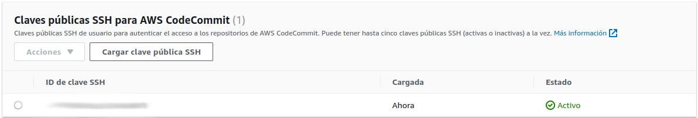

# Prácticas Devops en Amazon Web Services (AWS)
## AWS Code Commit

### Prepara el sistema operativo
#### Crea una nueva clave dejando los valores por defecto
```shell
ssh-keygen -t rsa -b 4096 -f ~/.ssh/codecommit_rsa
```

#### Sube la clave a AWS IAM teniendo en cuenta el usuario con el que ingresas a AWS, para este ejemplo, cloud_user
```shell
aws iam upload-ssh-public-key --user-name cloud_user --ssh-public-key-body file://~/.ssh/codecommit_rsa.pub
```

Si deseas verificar el resultado en la AWS Management Console dirígete a IAM -> Usuarios -> cloud_user -> Credenciales de seguridad -> Claves públicas SSH para AWS CodeCommit 

<div align="center">
  
</div>

#### Exporta el ID de la clave pública de SSH ya que lo necesitaras para finalizar la configuración de acceso
```shell
export SSHKEYID=$(aws iam list-ssh-public-keys --user-name cloud_user | grep -oP '(?<="SSHPublicKeyId": ")[^"]+' | awk 'NR==1')
echo $SSHKEYID
```

#### Agrega las siguientes líneas en el fichero config de SSH. Por defecto se encuentra en home/.ssh
```shell
cat << EOF >> ~/.ssh/config
Host git-codecommit.*.amazonaws.com
User $SSHKEYID
IdentityFile ~/.ssh/codecommit_rsa
EOF
```

#### Limita los permisos sobre el archivo
```shell
chmod 600 ~/.ssh/config
```

## Crea tu primer repositorio
```shell
cat << EOF > crear_repo.sh
#!/bin/bash

NOMBRE_REPO="mi-repositorio"
aws codecommit create-repository --repository-name $NOMBRE_REPO
EOF
```

### Modifica los permisos y ejecuta el script
```shell
chmod +x crear_repo.sh && ./crear_repo.sh
```

## Sube código
```shell
git clone ssh://git-codecommit.us-east-1.amazonaws.com/v1/repos/mi-repositorio
```

## Muévete al directorio descargado
```shell
cd mi-repositorio
```

## Siempre es buena idea comenzar con descripción creando un README
```shell
cat << EOF > README.md
Código de mi increíble aplicación que correrá en Kubernetes!"
EOF
```

## Sube el fichero a AWS Code Commit
```shell
git checkout -b main
git add README.md
git commit -m "README agregado"
git push origin main

```
## Ya puedes interactuar con AWS Code Commit. Felicitaciones!

[Volver](indice.md)