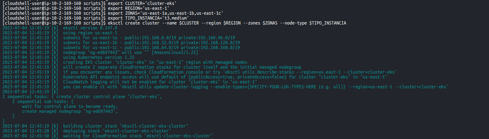
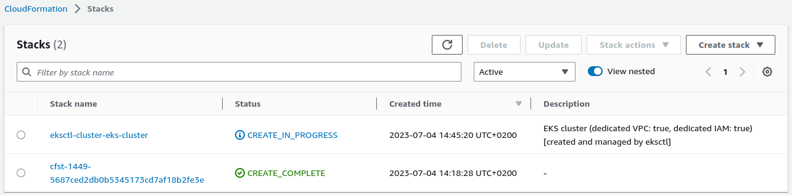
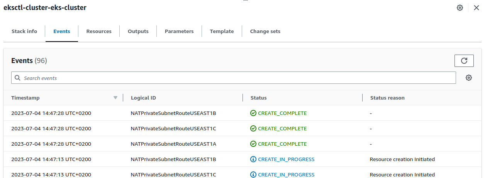
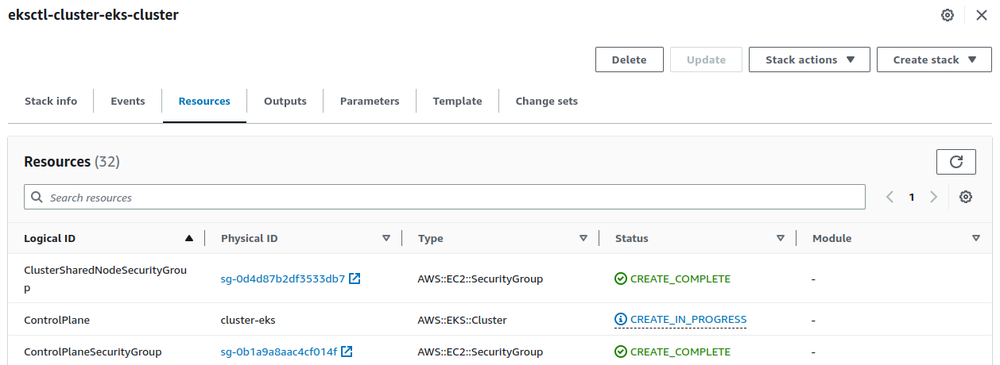
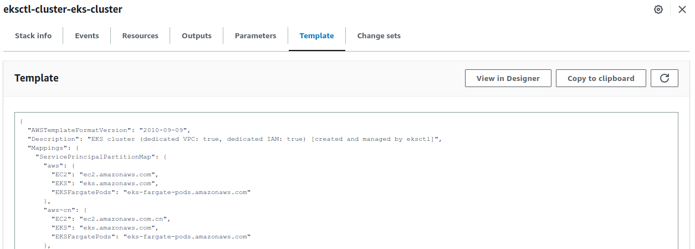

# Prácticas Devops en Amazon Web Services (AWS)
## Amazon Elastic Kubernetes Service (EKS)

Amazon Elastic Kubernetes Service (EKS) es un servicio de gestión de contenedores completamente administrado que facilita la ejecución de aplicaciones conteneirizadas utilizando Kubernetes en la nube de Amazon Web Services (AWS). 

EKS se encarga de gestionar la infraestructura de la capa de infraestructura en la que se ejecuta y administra el clúster de Kubernetes. Esto incluye los servidores, redes, almacenamiento y otros recursos necesarios para soportar el funcionamiento de los contenedores y la orquestación de Kubernetes, lo que te permite centrarte en desarrollar y ejecutar tus aplicaciones sin preocuparte por la administración del clúster.

## Lanza un cluster

Para este entrenamiento simularemos un cluster independiente y le iremos agregando todos los detalles de configuración necesarios para desplegar aplicaciones desde un pipeline. En otros casos, la creación y destrucción del cluster puede ser ejecutada como parte del propio pipeline.

Para construir nuestro clúster de Amazon Elastic Kubernetes Service (EKS), utilizaremos una herramienta llamada eksctl. Eksctl es una herramienta de línea de comandos de código abierto que facilita la creación y administración de clústeres de EKS. Proporciona una interfaz simplificada para crear y gestionar la infraestructura subyacente necesaria para ejecutar tus aplicaciones en EKS.

Eksctl automatiza gran parte del proceso de implementación del clúster de EKS, lo que lo hace conveniente y eficiente. En la AWS CloudShell ya debería estar disponible dado que fue el primer paso de configuración automatizado luego de clonar el repositorio del entrenamiento.

### Configura variables para facilitar la reutilización

Antes de desplegar tu clúster de Amazon EKS, es conveniente configurar algunas variables que te permitirán personalizar y reutilizar fácilmente los valores en tu entorno. A continuación, se muestran algunas variables que puedes establecer:

```shell
export CLUSTER='cluster-eks'
export REGION='us-east-1'
export ZONAS='us-east-1a,us-east-1b,us-east-1c'
export TIPO_INSTANCIA='t3.medium'
```

### Aprovecha eksctl

Este comando utilizará los valores de las variables previamente configuradas para especificar el nombre del clúster, la región de AWS, las zonas de disponibilidad y el tipo de instancia para los nodos del clúster.

```shell
eksctl create cluster --name $CLUSTER --region $REGION --zones $ZONAS --node-type $TIPO_INSTANCIA
```

Una vez completada la ejecución del comando, tendrás tu clúster de EKS listo para utilizar y desplegar tus aplicaciones basadas en contenedores. 

Mientras tanto puedes ir siguiendo el progreso desde la propia AWS CloudShell, dado que va logueando su recorrido y si existiera un problema podrías verlo directamente allí.

<div align="center">
  
</div>


Otra vista ya mas detallada podrás obtenerla directamente desde Amazon CloudFormation.

<div align="center">
  
</div>

Si haces clic sobre el nombre del template podrás revisar los eventos.

<div align="center">
  
</div>

También podrás ver los recursos.

<div align="center">
  
</div>

Y una recomendación muy fuerte es la de revisar la plantilla de CloudFormation para ir tomando práctica en la descripción de la infraestructura.

<div align="center">
  
</div>


Como una configuración tan compleja requiere tiempo, y ya hemos recorrido bastante en este camino de aprendizaje, es un buen momento para una pausa e ir por un café. 

Mientras tanto eksctl se encargará del resto!

## Configura el kubeconfig

Después de crear tu clúster de EKS, necesitarás configurar el fichero kubeconfig para poder interactuar con él utilizando la línea de comandos de Kubernetes.

Este comando actualizará automáticamente tu kubeconfig local, en este caso en particular en la AWS CloudShell, con la información de tu clúster de EKS, incluyendo el nombre del clúster, la región y los datos de autenticación necesarios.

```shell
aws eks update-kubeconfig --name $CLUSTER --region $REGION
```

[Volver](indice.md)