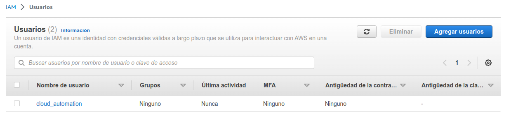

# Prácticas Devops en Amazon Web Services (AWS)
## AWS Identity and Access Management


### Crea el usuario cloud_automation
#### Para evitar el uso de credenciales personales define un nuevo usuario siguiendo el principio de menores privilegios
```shell
aws iam create-user --user-name cloud_automation

```

#### IAM te mostrará gráficamente el usuario y puede navegar entre las opciones para comprobar que aún no tiene ningún privilegio

<div align="center">
  
</div>

[Volver](indice.md)