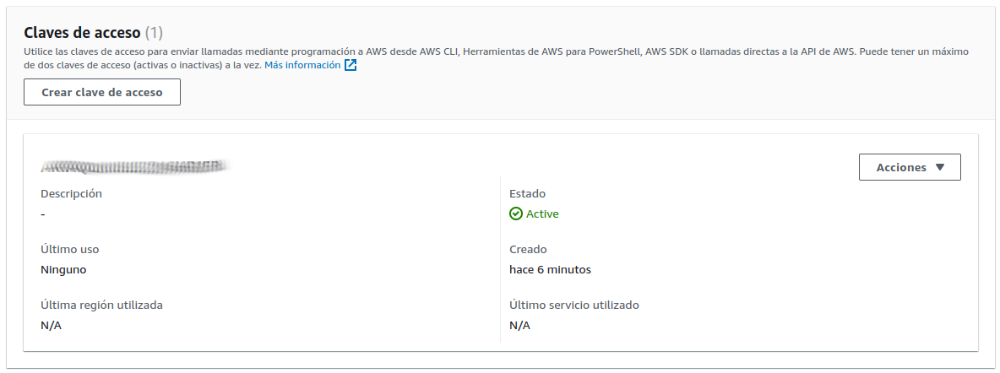

# Prácticas Devops en Amazon Web Services (AWS)
## AWS Identity and Access Management


### Crea el usuario cloud_automation
#### Para evitar el uso de credenciales personales define un nuevo usuario siguiendo el principio de menores privilegios
```shell
aws iam create-user --user-name cloud_automation
```

#### IAM te mostrará gráficamente el usuario y puede navegar entre las opciones para comprobar que aún no tiene ningún privilegio

<div align="center">
  
</div>

### Configura el acceso programático
#### Aprovecha la salida para guardar las llaves en variables
```shell
OUTPUT=$(aws iam create-access-key --user-name cloud_automation --query 'AccessKey.[AccessKeyId,SecretAccessKey]' --output text)
read -r ACCESSKEYID SECRETACCESSKEY <<< "$OUTPUT"

# Imprimo los valores solamente para verificar, en Producción no es recomendable mostrar las claves
echo "Access Key ID: $ACCESSKEYID"
echo "Secret Access Key: $SECRETACCESSKEY"
```

<div align="center">
  
</div>

### Importante: No es posible recuperar la Secret Access Key
### Si por algún motivo no pudiste guardar las llaves en las variables, no te preocupes, bórrala y configura nuevamente el acceso programático
```shell
aws iam delete-access-key --user-name cloud_automation --access-key-id $(aws iam list-access-keys --user-name cloud_automation | jq -r '.AccessKeyMetadata[0].AccessKeyId'
```

[Volver](indice.md)