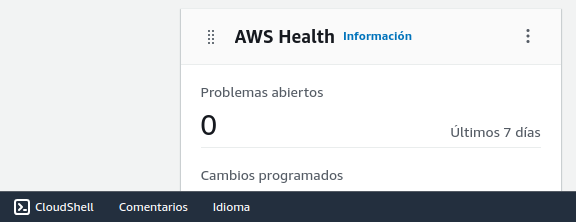
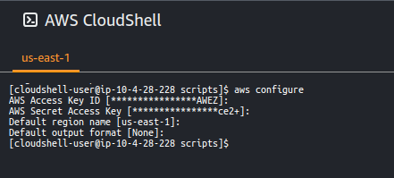

# Prácticas Devops en Amazon Web Services (AWS)

En este entrenamiento de Prácticas DevOps en Amazon Web Services (AWS), exploraremos cómo integrar el desarrollo y las operaciones de manera eficiente en el entorno de AWS. A medida que las organizaciones buscan mejorar la entrega de software y optimizar sus procesos, DevOps se ha vuelto fundamental. Aprenderemos estrategias, técnicas y mejores prácticas para construir y desplegar aplicaciones en la nube de manera confiable y eficiente.

## Herramientas requeridas

Durante este entrenamiento de Prácticas DevOps en Amazon Web Services (AWS), nos beneficiaremos del uso de la CloudShell, una poderosa herramienta basada en la nube que nos brinda un entorno de línea de comandos preconfigurado y listo para usar. La CloudShell nos permite acceder y administrar nuestros recursos de AWS de manera conveniente, sin necesidad de instalar software adicional en nuestros equipos locales. Instalaremos y configuraremos herramientas adicionales según nuestras necesidades específicas. Estas herramientas complementarias nos ayudarán a automatizar tareas y optimizar la entrega de software en el entorno de AWS. Si sientes curiosidad de ver como se instalan echa un vistazo a prepara-cloudshell.sh que se encuentra dentro del directorio scripts.

### Entorno de pruebas

Para llevar a cabo los ejercicios y prácticas de este entrenamiento, necesitarás acceso a los servicios de AWS. Si no lo tienes aún, puedes solicitar una AWS Sandbox de [A Cloud Guru](https://learn.acloud.guru/cloud-playground/cloud-sandboxes). La AWS Sandbox es un entorno virtualizado y preconfigurado que te permitirá explorar y experimentar con los servicios de AWS de forma segura y sin sorpresas de costos adicionales.

### Acceso programático

Inicia sesión en la consola de administración de AWS y abre una terminal de AWS CloudShell. Puedes encontrarla desde el buscador de servicios o directamente haciendo clic en el ícono de la AWS CloudShell en la esquina inferior izquierda de la consola de administración de AWS. 
La AWS CloudShell se abrirá dentro del espacio de la consola pero para mayor comodidad puedes iniciarla en una pestaña nueva del navegador.

<div align="center">
  
</div>

Configura el acceso programático tomando las credenciales de la bienvenida a AWS Sandbox y la región de la consola de administración de AWS (Ej: us-east-1).
```shell
aws configure
```

<div align="center">
  
</div>

Para facilitar la configuración inicial, hemos creado un repositorio en GitHub que contiene los scripts necesarios para instalar y configurar las herramientas requeridas en la AWS CloudShell de forma automatizada. 

Sigue estos pasos para clonar el repositorio y ejecutar los scripts:

```shell
git clone https://github.com/patricio-chavez/entrenamientos-aws.git && cd $HOME/entrenamientos-aws/devops/scripts
chmod +x prepara-cloudshell.sh && ./prepara-cloudshell.sh && cd $HOME

```

### ¡Todo listo! ¡Comencemos la práctica!

¡Felicidades! Ahora tienes todas las herramientas y configuraciones necesarias para comenzar con el entrenamiento. Es el momento de poner en práctica tus habilidades de DevOps y explorar los diferentes escenarios y ejercicios que te presentaremos. Sigue las instrucciones y guías proporcionadas en cada sección y no dudes en experimentar y probar cosas nuevas a medida que avanzas en tu aprendizaje.

Recuerda que puedes consultar la documentación oficial de AWS, buscar en la comunidad de desarrolladores y contar con el apoyo de todos tus compañeros de Realnaut si tienes alguna pregunta o enfrentas algún desafío durante el entrenamiento.

## Camino de aprendizaje

Este camino de aprendizaje en AWS DevOps te guiará a través de una serie de temas clave que te ayudarán a dominar las prácticas de desarrollo y operaciones en el entorno de Amazon Web Services (AWS). Cada tema aborda una herramienta o servicio específico de AWS con un enfoque práctico fundamental para implementar y gestionar de manera eficiente las soluciones en la nube.

A medida que avanzas en este camino de aprendizaje, aprenderás cómo utilizar AWS Code Commit para gestionar tus repositorios de código de forma segura. Luego, te adentrarás en AWS Identity and Access Management (IAM) para configurar el acceso programático y garantizar la seguridad de tus recursos en AWS. Además, descubrirás cómo utilizar AWS Secrets Manager para almacenar y recuperar de forma segura las credenciales y secretos necesarios en tus aplicaciones.

A continuación, explorarás AWS CloudFormation para desplegar y administrar la infraestructura como código, lo que te permitirá crear y gestionar recursos de manera automatizada y consistente. Te sumergirás en AWS EKS (Elastic Kubernetes Service) para desplegar y gestionar clústeres de Kubernetes en la nube de AWS, y aprenderás a desplegar aplicaciones en este entorno escalable y altamente disponible. Y mucho más!

Sigue este camino de aprendizaje paso a paso, completa los ejercicios prácticos y consolida tus conocimientos en AWS DevOps. 

- [AWS Code Commit](codecommit.md)
  - [Prepara el sistema operativo](codecommit.md#Prepara-el-sistema-operativo)
  - [Crea tu primer repositorio](codecommit.md#Crea-tu-primer-repositorio)
  - [Sube código](codecommit.md#Sube-código)

- [AWS Identity and Access Management](iam.md)
  - [Crea el usuario cloud_automation](iam.md#Crea-el-usuario-cloud_automation)
  - [Configura el acceso programático](iam.md#Configura-el-acceso-programático)

- [AWS Secrets Manager](secretsmanager.md)
  - [Resguarda credenciales](secretsmanager.md#Resguarda-credenciales)
  - [Recupera credenciales](secretsmanager.md#Resguarda-recupera)

- [AWS CloudFormation](cloudformation.md)
  - [Primera plantilla](cloudformation.md#Primera-plantilla)

- [AWS EKS](eks.md)
  - [Despliega un cluster](eks.md#Despliega-un-cluster-EKS)
  - [Configura el acceso programático](eks.md#Configura-el-kubeconfig)
  - [Despliega una aplicación](eks.md#Depliega-una-aplicación)