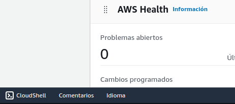
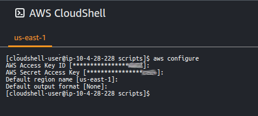

# Prácticas Devops en Amazon Web Services (AWS)

## Herramientas requeridas
- Solicita una AWS Sandbox de [A Cloud Guru](https://learn.acloud.guru/cloud-playground/cloud-sandboxes).
- Loguéate y abre una terminal AWS CloudShell.

<div align="center">
  
</div>

- Configura el acceso programático tomando las credenciales de la bienvenida a AWS Sandbox y la región de la AWS Management Console (Ej: us-east-1).
```shell
aws configure
```

<div align="center">
  
</div>

- Clona el repositorio e instala las herramientas de forma automatizada
```shell
git clone https://github.com/patricio-chavez/entrenamientos-aws.git && cd $HOME/entrenamientos-aws/devops/scripts
chmod +x prepara-cloudshell.sh && ./prepara-cloudshell.sh && cd $HOME

```

## [AWS Code Commit](codecommit.md)
### [Prepara el sistema operativo](codecommit.md#Prepara-el-sistema-operativo)
### [Crea tu primer repositorio](codecommit.md#Crea-tu-primer-repositorio)
### [Sube código](codecommit.md#Sube-código)

## [AWS Identity and Access Management](iam.md)
### [Crea el usuario cloud_automation](iam.md#Crea-el-usuario-cloud_automation)
### [Configura el acceso programático](iam.md#Configura-el-acceso-programático)

## [AWS Secrets Manager](secretsmanager.md)
### [Resguarda credenciales](secretsmanager.md#Resguarda-credenciales)
### [Recupera credenciales](secretsmanager.md#Resguarda-recupera)

## [AWS CloudFormation](cloudformation.md)
### [Primera plantilla](cloudformation.md#Primera-plantilla)

## [AWS EKS](eks.md)
### [Despliega un cluster](eks.md#Despliega-un-cluster-EKS)
### [Configura el acceso programático](eks.md#Configura-el-kubeconfig)
### Depliega una aplicación