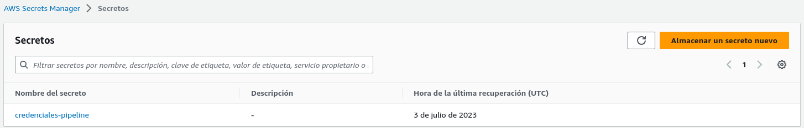
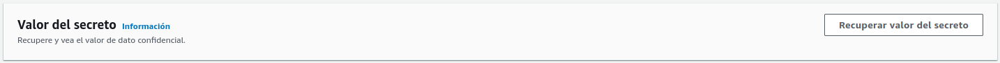

# Prácticas Devops en Amazon Web Services (AWS)
## AWS Secrets Manager

AWS Secrets Manager es un servicio de gestión de secretos completamente administrado por AWS. Secrets Manager te permite almacenar y gestionar de manera segura información sensible, como claves de API, contraseñas de bases de datos y otros secretos, eliminando la necesidad de almacenarlos en texto plano en tus aplicaciones o sistemas.

Con Secrets Manager, puedes crear, recuperar, rotar y eliminar secretos de forma segura y automatizada. Además, el servicio ofrece integraciones con otros servicios de AWS, lo que te permite acceder a tus secretos de manera segura y protegida en tus aplicaciones y entornos de desarrollo.

### Resguarda credenciales

Exploraremos algunas prácticas comunes para trabajar con AWS Secrets Manager y cómo puedes utilizarlo para asegurar la gestión de tus secretos en la nube.

#### Guarda las credenciales del usuario cloud_automation

Con el siguiente código, se genera un número aleatorio para garantizar que el nombre del secreto sea único. Luego, se utiliza el comando aws secretsmanager create-secret para crear el secreto en AWS Secrets Manager. El nombre del secreto se forma concatenando "credenciales-automation-" con el número aleatorio generado.

Las credenciales del usuario cloud_automation, incluyendo la ACCESS_KEY_ID y SECRET_ACCESS_KEY, se proporcionan como un objeto JSON en el parámetro --secret-string. Estas credenciales estarán protegidas y disponibles para su uso seguro en tus aplicaciones y servicios.

```shell

# Guardar las credenciales en un secreto
export NUMERO_ALEATORIO=$(shuf -i 10000000-99999999 -n 1)
export NOMBRE_SECRETO=credenciales-automation-$NUMERO_ALEATORIO
aws secretsmanager create-secret --name $NOMBRE_SECRETO --secret-string '{"ACCESS_KEY_ID": "'"$ACCESS_KEY_ID"'", "SECRET_ACCESS_KEY": "'"$SECRET_ACCESS_KEY"'"}'
```
Importante: Creando un valor de secreto con un componente aleatorio garantiza que durante tu aprendizaje puedas borrar y recrear los secretos simplemente ejecutando nuevamente las mismas piezas de código. Si el nombre del secreto fuera fijo y lo borraras, al volver a ejecutar el código proporcionado daría un error de creación porque no se eliminan los secretos de forma inmediata. Los secretos que se intentan borrar siempre se marcan para ser eliminados a futuro.

### Verifica el secreto con la consola de administración de AWS

Desde la consola de administración de AWS también se puede observar el secreto "credenciales-pipeline" almacenado en AWS Secrets Manager. Este secreto contiene las credenciales del usuario "cloud_automation" en forma de un objeto JSON que incluye tanto la ACCESS_KEY_ID como la SECRET_ACCESS_KEY. 

<div align="center">
  
</div>

### Recupera credenciales

Este comando te permitirá obtener las credenciales programáticamente desde el secreto especificado. Sin embargo, es importante tener precaución al manejar estas credenciales y evitar exponerlas innecesariamente. Recuerda que el objetivo de utilizar un servicio como Secrets Manager es mantener las credenciales de forma segura y controlada, evitando su exposición en texto plano o en ficheros de configuración. Al utilizar estas credenciales en tus aplicaciones o servicios, asegúrate de seguir las mejores prácticas de seguridad para protegerlas adecuadamente.

```shell
aws secretsmanager get-secret-value --secret-id $NOMBRE_SECRETO
```

### Secretos desde la consola de administración AWS

Otra forma de recuperar y verificar las credenciales del secreto "credenciales-pipeline" es a través de la consola de administración AWS.

<div align="center">
  
</div>


Esto te permite visualizar y verificar las credenciales almacenadas en el secreto de forma segura. Recuerda seguir las mejores prácticas de seguridad al trabajar con estas credenciales y limitar su exposición solo a los sistemas y aplicaciones que las necesitan.

<div align="center">
  
</div>

Continua con [AWS EKS](eks.md). También puedes revisar nuevamente el paso anterior [AWS Identity and Access Management](iam.md) o volver al [Indice](indice.md)