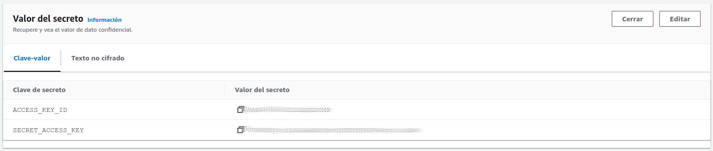

# Prácticas Devops en Amazon Web Services (AWS)
## AWS Secrets Manager


### Resguarda credenciales
#### Guarda las credenciales del usuario cloud_automation
```shell
aws secretsmanager create-secret --name credenciales-pipeline --secret-string '{"ACCESS_KEY_ID": "'"$ACCESS_KEY_ID"'", "SECRET_ACCESS_KEY": "'"$SECRET_ACCESS_KEY"'"}'
```

<div align="center">
  
</div>

### Recupera credenciales
#### Es posible recuperar las credenciales programáticamente pero ten precaución de no exponerlas en forma innecesaria
```shell
aws secretsmanager get-secret-value --secret-id credenciales-pipeline
```

#### Otra manera de recuperarlas, y verificación, es a través de la AWS Management Console

<div align="center">
  
</div>

<div align="center">
  
</div>

[Volver](indice.md)